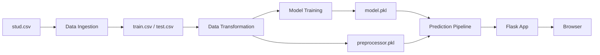
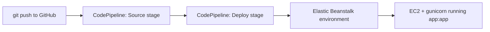

# Student Exam Performance Indicator

An end-to-end machine learning project that predicts a student's **math score**
from their demographic profile and reading/writing scores, served through a
Flask web app and deployable to AWS Elastic Beanstalk via a CodePipeline CD
pipeline.

- **Live predictor:** `/predictdata` &mdash; fill in a student profile, get a
  predicted math score with a result meter.
- **Best model:** tuned via `GridSearchCV` across 7 regressors, R&sup2; &asymp; 0.88
  on the held-out test set.

---

## How it works

The project is split into isolated, single-responsibility stages that mirror a
production ML pipeline &mdash; from raw CSV to a served prediction.



### 1. Data Ingestion &mdash; [`src/components/data_ingestion.py`](src/components/data_ingestion.py)
Reads `notebook/data/stud.csv`, splits it into train/test sets, and writes
`artifacts/data.csv`, `artifacts/train.csv`, `artifacts/test.csv`.

### 2. Data Transformation &mdash; [`src/components/data_transformation.py`](src/components/data_transformation.py)
Builds a `ColumnTransformer`:
- **Numeric** (`reading_score`, `writing_score`): median imputation + `StandardScaler`.
- **Categorical** (`gender`, `race_ethnicity`, `parental_level_of_education`,
  `lunch`, `test_preparation_course`): most-frequent imputation + `OneHotEncoder`
  + `StandardScaler(with_mean=False)`.

The fitted transformer is pickled to `artifacts/preprocessor.pkl`.

### 3. Model Training &mdash; [`src/components/model_trainer.py`](src/components/model_trainer.py)
Trains and tunes 7 regressors (Linear Regression, Decision Tree, Random Forest,
Gradient Boosting, AdaBoost, XGBoost, CatBoost) with `GridSearchCV`, scores each
by R&sup2; on the test split, and pickles the best one to `artifacts/model.pkl`.

Run the full ingestion &rarr; transformation &rarr; training pipeline:

```bash
python -m src.components.data_ingestion
```

### 4. Prediction Pipeline &mdash; [`src/pipeline/predict_pipeline.py`](src/pipeline/predict_pipeline.py)
`PredictPipeline.predict()` loads `model.pkl` and `preprocessor.pkl`, transforms
a new `CustomData` record, and returns the predicted math score.

### 5. Web App &mdash; [`app.py`](app.py)
A Flask app exposing:
| Route | Method | Purpose |
|---|---|---|
| `/` | GET | Project landing page ([`templates/index.html`](templates/index.html)) |
| `/predictdata` | GET | Prediction form ([`templates/home.html`](templates/home.html)) |
| `/predictdata` | POST | Runs the prediction pipeline and re-renders the form with the result |

`app.py` exposes the WSGI application as the module-level variable **`app`**
(`app = Flask(__name__)`) &mdash; this name matters for deployment, see below.

---

## Project structure

```
├── app.py                          # Flask entrypoint (WSGI object: `app`)
├── Procfile                        # Tells Elastic Beanstalk how to start the app
├── requirements.txt
├── .ebextensions/
│   └── python.config                # Legacy EB Python-platform option (see caveat below)
├── .github/workflows/
│   └── main_studentssperformance3.yml   # CI/CD to Azure Web App
├── notebook/                       # EDA & experimentation notebooks + raw dataset
├── src/
│   ├── components/                 # data_ingestion, data_transformation, model_trainer
│   ├── pipeline/                   # predict_pipeline, train_pipeline
│   ├── exception.py, logger.py, utils.py
├── artifacts/                      # Generated: train/test CSVs, model.pkl, preprocessor.pkl
└── templates/                      # index.html (landing), home.html (predictor + result)
```

---

## Running locally

```bash
python -m venv env
env\Scripts\activate          # Windows
pip install -r requirements.txt

# (re)train the model — writes artifacts/model.pkl and artifacts/preprocessor.pkl
python -m src.components.data_ingestion

# start the app
python app.py
```

Visit `http://localhost:5000/`.

---

## Deploying to AWS Elastic Beanstalk (CodePipeline CD)

This repo deploys to Elastic Beanstalk through **AWS CodePipeline**, which
watches this GitHub repo and redeploys automatically on every push &mdash; there
is no GitHub Actions workflow for this path; the pipeline lives entirely in the
AWS Console/CLI.



### How the app boots on Elastic Beanstalk

The modern EB Python platform (**Amazon Linux 2 / 2023**) does **not** use the
`aws:elasticbeanstalk:container:python` / `WSGIPath` option &mdash; that's a
legacy setting from the retired Amazon Linux 1 Python platform. On AL2/2023, EB
looks for a **`Procfile`** and runs whatever command it specifies:

```
web: gunicorn --bind :8000 --workers 3 app:app
```

This is why [`Procfile`](Procfile) and `gunicorn` in
[`requirements.txt`](requirements.txt) are required &mdash; without them EB
falls back to its own default (`application:application`), won't find `app.py`,
and the environment goes into a degraded/crash state.

> **`.ebextensions/python.config` is a legacy holdover.** It's harmless to
> leave in place (AL2/2023 ignores the unrecognized namespace), but it has no
> effect on deployment &mdash; the `Procfile` is what actually controls startup.

### One-time setup

1. **Create the Elastic Beanstalk application & environment**
   - Console &rarr; Elastic Beanstalk &rarr; *Create application*.
   - Platform: **Python** (Amazon Linux 2023 branch).
   - Upload the repo once (zipped) to create the initial environment, or let
     CodePipeline's first run create it.

2. **Create the CodePipeline**
   - Console &rarr; CodePipeline &rarr; *Create pipeline*.
   - **Source stage:** provider = GitHub (via GitHub App connection), repo =
     this repo, branch = `main`. Triggers on every push.
   - **Build stage:** skip, or add CodeBuild if you want tests to gate deploys.
   - **Deploy stage:** provider = **AWS Elastic Beanstalk**, select the
     application/environment created in step 1.

3. **Push to `main`** &mdash; CodePipeline picks up the commit, ships the
   source zip to Elastic Beanstalk, EB installs `requirements.txt` and starts
   the app via the `Procfile`.

### Verifying a deployment

- EB Console &rarr; environment &rarr; **Health** should read *Ok* (green).
- **Logs &rarr; Request Last 100 Lines** will show the `gunicorn` startup line
  if it booted correctly, or the import error if `app:app` couldn't be found.
- Hit the environment URL's `/` and `/predictdata` routes directly.

### Note on the Azure path

[`.github/workflows/main_studentssperformance3.yml`](.github/workflows/main_studentssperformance3.yml)
is a **separate, independent CD path** that deploys this same app to an Azure
Web App on every push via GitHub Actions. The two are unrelated &mdash; you can
run either, both, or neither.

---

## Model performance

| Metric | Value |
|---|---|
| Best model R&sup2; (test set) | **0.88** |
| Regressors compared | 7 (Linear, Decision Tree, Random Forest, Gradient Boosting, AdaBoost, XGBoost, CatBoost) |
| Tuning method | `GridSearchCV`, 3-fold |

## Tech stack

Python &middot; Flask &middot; scikit-learn &middot; Pandas &middot; NumPy &middot;
CatBoost &middot; XGBoost &middot; gunicorn &middot; AWS Elastic Beanstalk &middot;
AWS CodePipeline &middot; Azure Web Apps &middot; GitHub Actions
